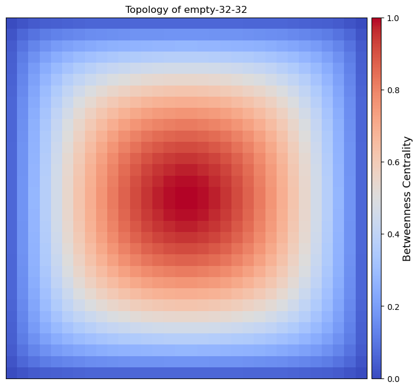
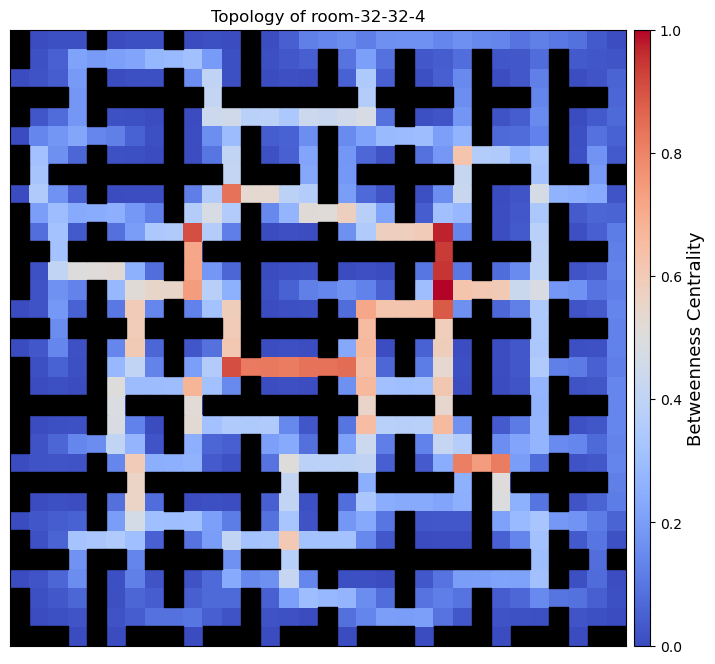
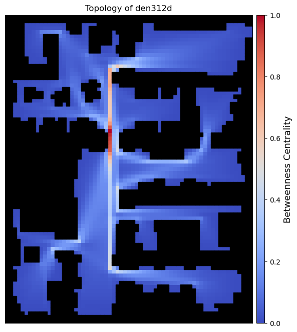

# TopologyAnalysis

This Python library facilitates the analysis of environment topologies for robotic navigation and pathfinding. Leveraging Brandes' Betweenness Centrality Algorithm, it computes a normalized betweenness centrality score for a given environment representation and visualizes the results as a heatmap overlay.

## Dependencies
This library requires:

 1. `numpy`
 2. `matplotlib`

## Usage

To reproduce our results, start by extracting all benchmarks:

    ./init.sh

Next, score the benchmarks. This process may take time; all scores will be saved in the `scored_benchmarks` directory:

    python score.py

Finally, generate visualizations with the following command. All images will be saved in the `figures` directory:

    python visualize.py

If you do not wish to reproduce the results for all benchmarks, you will need to modify the list of maps that are evaluated in both `score.py` and `visualize.py`.

## Betweenness Centrality Visualization
| Map Name| Betweenness Centrality Visualization | 
|--|--|
|  empty-8-8 |  | 
|  empty-16-16 |  | 
|  empty-32-32 |  | 
|  empty-48-48 |  | 
|  random-32-32-10 |  | 
|  random-32-32-20 |  | 
|  random-64-64-10 |  | 
|  random-64-64-20 |  | 
|  room-32-32-4 |  |
|  room-64-64-8 |  |
|  room-64-64-16 |  | 
|  maze-32-32-2 |  |
|  maze-32-32-4 |  
|  maze-128-128-10 |  |  
|  maze-128-128-2 |  | 
|  Berlin_1_256 |  |
|  Boston_0_256 |  
|  Paris_1_256 |  | 
|  ht_chantry |  | 
|  ht_mansion_n |  
|  lak303d |  | 
|  lt_gallowstemplar_n |  | 
|  den312d |  | 
|  ost003d |  | 
|  brc202d |  | 
|  den520d |  | 
|  w_woundedcoast |  |

